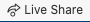
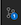

# Data 8 Public Materials for Spring 2022

This repo contains the publicly available materials that are used in the Data 8 Foundations of Data Science course during the Spring 2022 semester.

This includes: homeworks, labs, and notebooks used in lecture.

Course Calendars:
- [Example Course Calendar from UCB Data 8](http://data8.org/materials-sp22/)
- [Course Calendar with link to Colab, Deepnote, Binder, and HTML Versions](http://data8.org/materials-sp22/demo.html)

The contents of this repository are licensed for reuse under [Creative Commons Attribution-NonCommercial 4.0 International (CC BY-NC 4.0)](http://creativecommons.org/licenses/by-nc/4.0/)

## VS Code/CodeSpace Usage
**Kernel:**
You will need to select a Python kernel when you run a cell in a notebook for the first time. The default is `Python 3.10.11`. Select this option.

**Live Share**
This allows you to collaborate with a partner on same set of code. 
1) Click "Live Share" on the status bar 
2) Follow the on-screen pop-up dialog instructions
3) Send the invitation to your partner

**Saving Work in CodeSpace**
When you save your work(Ctrl-S or File --> Save), you are saving your changes to the Virtual Machine running VSCode in CodeSpace. This does **not** mean you are changes are saved to the repository.

In order to permanently save your work, you need to:

1) Click the "Source Control" button on the left-hand side menu bar. 
2) You will see a list of files that have changes that are not saved to your repository.
3) In the message box, give a descriptive(and short) sentence explaining the changes.
4) Click "Commit"
5) After a few seconds, the button will say "Sync Changes". Click it again to save the changes to your repository.